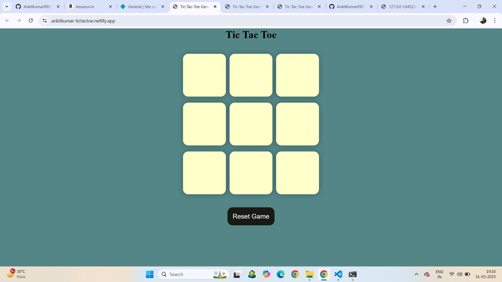
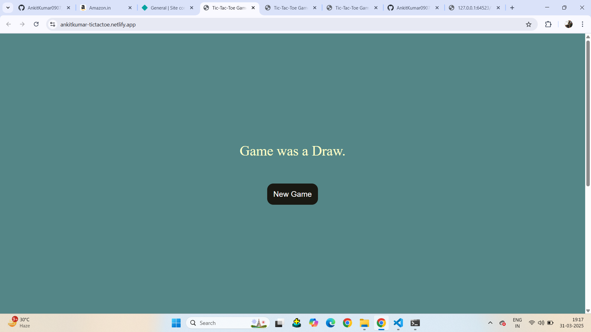

---

## 🏆 Tic-Tac-Toe  
*A classic game of strategy and fun!*  

  

### 📌 Overview  
Tic-Tac-Toe is a simple yet engaging game played between two players on a 3×3 grid. This project brings the timeless game to life with a clean interface and intuitive gameplay. .  

### ✨ Features  
✅ **Two-player mode** – Challenge a friend and test your strategy!  
✅ **Responsive UI** – A clean and interactive interface for smooth gameplay.  
✅ **Win detection** – Highlights the winning combination automatically.  
✅ **Reset option** – Restart the game anytime with a single click.  

### 🚀 How to Run  
1. **Clone the repository:**  
   ```sh
   git clone https://github.com/AnkitKumar0907/Tic-Tac-Toe-Game.git
   cd Tic-Tac-Toe-Game
   open index.html in browser
   ```  


### 📷 Screenshots  
| Game Start  | Winning Move  | Game Over  |  
|-------------|--------------|------------|  
|   |   |  |  

### 🛠 Technologies Used  
- ** JavaScript  / HTML & CSS **

### 📝 To-Do List  
🔹 Add animations and sound effects  
🔹 Implement multiplayer online mode  


---
